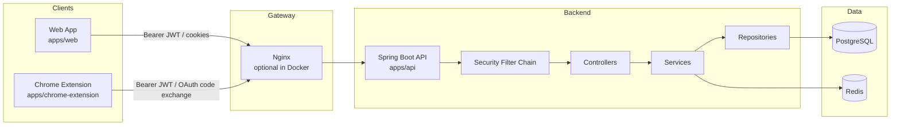
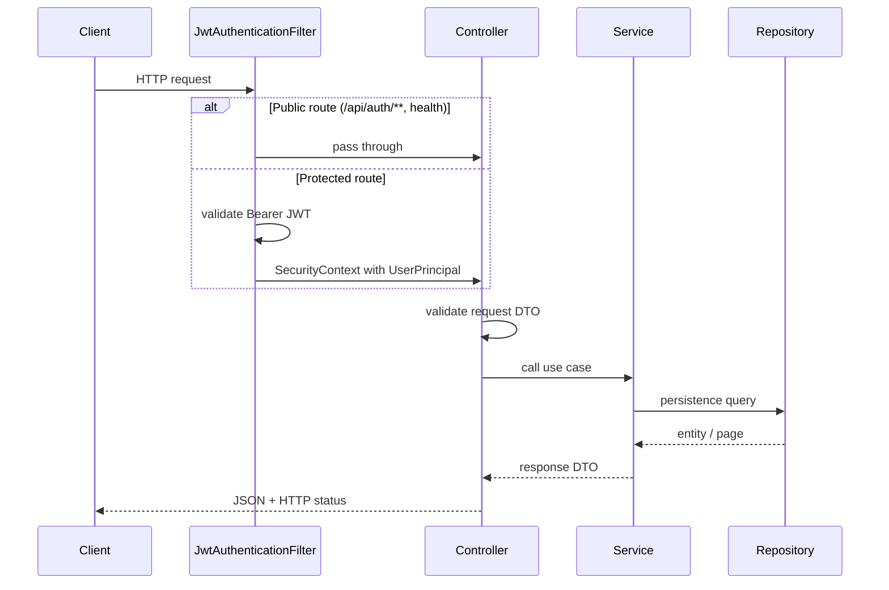
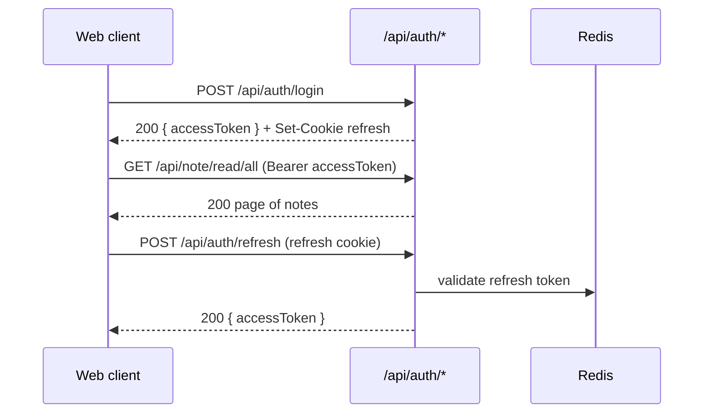
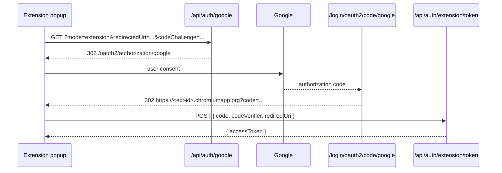
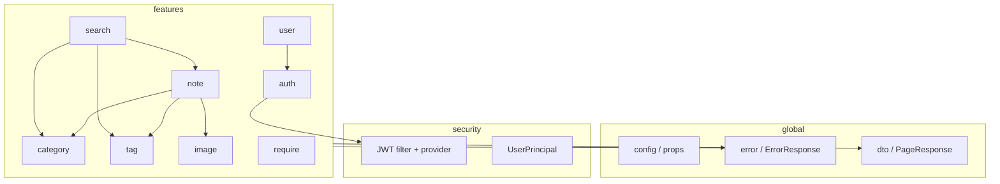

# API Reference

Sisyphus Academy exposes a JSON REST API from `apps/api`. All application routes
live under the `/api` prefix unless noted otherwise.

## Quick links

| Resource | Local URL |
| --- | --- |
| Swagger UI | `http://localhost:8080/swagger-ui/index.html` |
| OpenAPI JSON | `http://localhost:8080/v3/api-docs` |
| Generated spec (CI artifact) | `apps/api/build/generated/openapi/openapi.json` |

Swagger UI is enabled outside production. Control it with `SPRINGDOC_ENABLED` and
`SWAGGER_UI_ENABLED`.

---

## System context



---

## Request lifecycle



### Layer rules

| Layer | Responsibility | Must not |
| --- | --- | --- |
| Controller | transport, auth principal extraction, status mapping | business rules, repository access |
| Service | use-case orchestration, ownership checks, transactions | HTTP details |
| Repository | queries and persistence | response shaping for clients |
| DTO | request/response contracts | JPA mapping |

Write use cases use `@Transactional` on service methods. Read use cases that need
a persistence context use `@Transactional(readOnly = true)`.

---

## Authentication

### Web session model

| Credential | Transport | Used for |
| --- | --- | --- |
| Access token | `Authorization: Bearer <token>` response body | API calls |
| Refresh token | HttpOnly cookie | `POST /api/auth/refresh`, logout |



### Chrome extension model

| Flow | Access token | Refresh token |
| --- | --- | --- |
| Local login | `POST /api/auth/extension/login` | not issued |
| Google OAuth | `POST /api/auth/extension/token` after PKCE code exchange | not issued |

Extension OAuth uses `mode=extension` and a registered
`https://<extension-id>.chromiumapp.org` redirect URI. See
[OAUTH_SETUP.md](./OAUTH_SETUP.md).

---

## Authorization matrix

| Scope | Paths | Requirement |
| --- | --- | --- |
| Public | `/api/auth/**`, `/api/health/**`, `/actuator/health/**`, `/actuator/info` | none |
| Local/dev only | `/v3/api-docs/**`, `/swagger-ui/**`, `/uploads/**` | none |
| Authenticated | all other `/api/**` | valid JWT |
| Admin | selected `/api/user/count`, `/api/require/*` admin routes | JWT + `ADMIN` role |

Ownership-sensitive resources (note, category, tag, image, require) enforce
user scope inside the service layer. Missing resources return `404`; cross-user
access returns `403`.

---

## Error contract

All expected failures return the shared `ErrorResponse` shape:

```json
{
  "status": 400,
  "code": "VALIDATION_ERROR",
  "message": "email: must be a well-formed email address.",
  "path": "/api/auth/check",
  "timestamp": "2026-07-26T00:00:00Z",
  "fieldErrors": [
    {
      "field": "email",
      "message": "must be a well-formed email address."
    }
  ]
}
```

| HTTP | Typical code | Meaning |
| ---: | --- | --- |
| 400 | `VALIDATION_ERROR` | Bean validation failed |
| 401 | `UNAUTHORIZED` | missing/invalid JWT or refresh token |
| 403 | domain / access code | authenticated but not allowed |
| 404 | domain not-found code | resource missing |
| 409 | conflict code | duplicate email, etc. |
| 500 | `INTERNAL_SERVER_ERROR` | unexpected server failure |

---

## Pagination

List endpoints that return pages use `PageResponse<T>`:

```json
{
  "content": [],
  "page": 0,
  "size": 10,
  "totalElements": 24,
  "totalPages": 3,
  "first": true,
  "last": false
}
```

Common query params:

| Param | Default | Notes |
| --- | --- | --- |
| `page` | `0` | zero-based |
| `size` | endpoint-specific | note lists default to `10` |
| `sort` | endpoint-specific | e.g. `createdAt,desc` |

---

## Endpoint catalog

### Auth — `/api/auth`

Controller: `AuthController`, `OAuthLinkController`  
Services: `AuthService`, `EmailAuthService`, `OAuthLinkService`

| Method | Path | Summary | Auth |
| --- | --- | --- | --- |
| POST | `/api/auth/signup` | Register; returns access token + refresh cookie | public |
| POST | `/api/auth/login` | Login; returns access token + refresh cookie | public |
| POST | `/api/auth/extension/login` | Extension local login; access token only | public |
| POST | `/api/auth/refresh` | Refresh access token from cookie | public |
| POST | `/api/auth/extension/token` | Exchange OAuth authorization code (PKCE) | public |
| POST | `/api/auth/logout` | Invalidate refresh token + clear cookie | public |
| POST | `/api/auth/check` | Email availability check | public |
| POST | `/api/auth/send-email` | Send verification email | public |
| POST | `/api/auth/verify-email` | Verify email code | public |
| GET | `/api/auth/{provider}` | Start OAuth (`google`) | public |

#### OAuth start query params

| Param | Required when | Purpose |
| --- | --- | --- |
| `mode` | optional | `link` or `extension` |
| `userId` | `mode=link` | account linking target |
| `redirectedUri` | `mode=extension` | `https://<extension-id>.chromiumapp.org` |
| `codeChallenge` | `mode=extension` | S256 PKCE challenge |
| `codeChallengeMethod` | `mode=extension` | `S256` |

`GET /api/auth/{provider}` responds with `302` to Spring Security
`/oauth2/authorization/{provider}`. The provider callback is handled by
`OAuth2LoginSuccessHandler` / `OAuth2LoginFailureHandler`.



---

### User — `/api/user`

Controller: `UserController`  
Services: `UserService`, `AccountService`

| Method | Path | Summary | Auth |
| --- | --- | --- | --- |
| POST | `/api/user/read` | Current user summary | JWT |
| POST | `/api/user/detail` | Current user + linked accounts | JWT |
| PUT | `/api/user/update` | Update profile name | JWT |
| DELETE | `/api/user/delete` | Delete current account | JWT |
| GET | `/api/user/count` | Total user count | JWT + `ADMIN` |

---

### Note — `/api/note`

Controller: `NoteController`  
Service: `NoteService`

| Method | Path | Summary | Auth |
| --- | --- | --- | --- |
| POST | `/api/note/create` | Create note → `201` + note id | JWT |
| GET | `/api/note/read/all` | Paginated list with optional filters | JWT |
| GET | `/api/note/read/{id}` | Read one note | JWT |
| PUT | `/api/note/update/{id}` | Update note | JWT |
| DELETE | `/api/note/delete/{id}` | Delete note → `204` | JWT |
| GET | `/api/note/categoryNull` | Notes without category | JWT |

#### `GET /api/note/read/all` filters

| Query | Type | Description |
| --- | --- | --- |
| `categoryId` | number | filter by category |
| `tagId` | number | filter by tag |
| `title` | string | title contains |
| `page`, `size`, `sort` | pagination | default sort `createdAt,desc` |

#### Dev-only seed

| Method | Path | Summary | Auth |
| --- | --- | --- | --- |
| POST | `/api/dev/note/seed` | Seed dummy notes (`local`/`dev` profile) | JWT |

---

### Category — `/api/category`

Controller: `CategoryController`  
Service: `CategoryService`

| Method | Path | Summary | Auth |
| --- | --- | --- | --- |
| GET | `/api/category/all` | List categories for current user | JWT |
| POST | `/api/category/create` | Create category | JWT |
| PUT | `/api/category/update/{id}` | Update category | JWT |
| DELETE | `/api/category/delete/{id}` | Delete category | JWT |

---

### Tag — `/api/tag`

Controller: `TagController`  
Service: `TagService`

| Method | Path | Summary | Auth |
| --- | --- | --- | --- |
| GET | `/api/tag` | List tags | JWT |
| POST | `/api/tag` | Create or fetch existing tag | JWT |
| PUT | `/api/tag/update` | Update tag | JWT |
| DELETE | `/api/tag` | Delete multiple tags | JWT |

---

### Image — `/api/image`

Controller: `ImageController`  
Service: `ImageService`

| Method | Path | Summary | Auth |
| --- | --- | --- | --- |
| POST | `/api/image` | Upload image (`multipart/form-data`, field `file`) | JWT |
| PUT | `/api/image/{id}` | Replace image file | JWT |
| DELETE | `/api/image/{id}` | Delete image | JWT |

Public image URLs are served from `/uploads/**` in local/dev profiles.

---

### Search — `/api/search`

Controller: `SearchController`  
Service: `SearchService`

| Method | Path | Summary | Auth |
| --- | --- | --- | --- |
| GET | `/api/search` | Unified search across tag/category/note | JWT |

| Query | Required | Default |
| --- | --- | --- |
| `q` | yes | — |
| `page`, `size`, `sort` | no | page size defaults to `5` |

---

### Require — `/api/require`

Controller: `RequireController`  
Service: `RequireService`

| Method | Path | Summary | Auth |
| --- | --- | --- | --- |
| POST | `/api/require/create` | Create requirement ticket | JWT |
| GET | `/api/require/readAll` | Paginated list for current user | JWT |
| GET | `/api/require/{id}` | Read one ticket | JWT |
| PUT | `/api/require/{id}` | Update ticket | JWT |
| DELETE | `/api/require/{id}` | Delete ticket | JWT |
| PUT | `/api/require/status/{id}` | Change status | JWT + `ADMIN` |
| GET | `/api/require/dashboard` | Admin dashboard list | JWT + `ADMIN` |
| POST | `/api/require/status/count` | Monthly status counts | JWT + `ADMIN` |

---

## Backend package map



Each feature package follows the same internal shape when present:

```text
feature/
├── controller/
├── service/
├── repository/
├── entity/
├── dto/
└── exception/
```

---

## Client integration notes

### Web (`apps/web`)

| Setting | Source | Purpose |
| --- | --- | --- |
| `VITE_API_BASE_URL` | root `.env` | API origin |
| `VITE_PROXY_TARGET` | root `.env` | Vite dev proxy target |
| `VITE_GOOGLE_CLIENT_ID` | root `.env` | OAuth client metadata |
| `VITE_GOOGLE_REDIRECT_URI` | root `.env` | web OAuth callback |

The dev server proxies `/api` and `/uploads` to the backend.

### Chrome extension (`apps/chrome-extension`)

| Setting | Current source | Purpose |
| --- | --- | --- |
| API base | hardcoded in `auth.constants.ts` | `BACK_URL` |
| App home | hardcoded `HOST_URL` | footer / header links |
| OAuth redirect | runtime `chrome.runtime.id` | `REDIRECT_URL` |
| Backend validation | root `.env` `APP_EXTENSION_HOST` | must match extension id |

See [DEVELOPMENT.md](./DEVELOPMENT.md#chrome-extension) and
[OAUTH_SETUP.md](./OAUTH_SETUP.md#chrome-extension-oauth).

---

## Keeping docs accurate

When you change an API:

1. update controller OpenAPI annotations and DTO `@Schema` metadata
2. run `./gradlew clean check` in `apps/api`
3. compare generated `apps/api/build/generated/openapi/openapi.json`
4. update this file if route groups, auth rules, or client contracts changed
