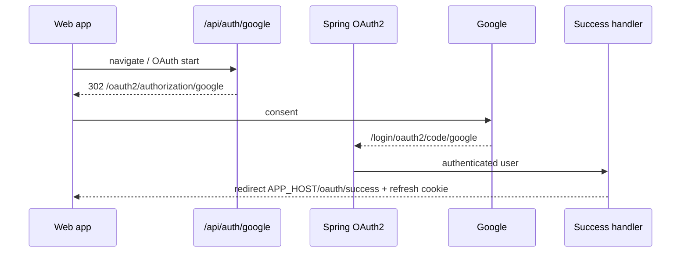
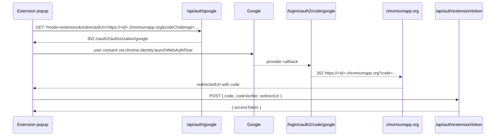

# OAuth Setup

Sisyphus Academy currently enables **Google Login** in code. Naver and Kakao
registrations remain commented out in the backend until those providers are
re-enabled.

OAuth credentials must never be committed. Store them only in local or deployment
environment files.

Related docs:

- [API.md](./API.md#auth--apiauth)
- [DEVELOPMENT.md](./DEVELOPMENT.md#environment-variables)

---

## Google (web + API)

Required variables:

```env
GOOGLE_CLIENT_ID=
GOOGLE_CLIENT_SECRET=
```

Redirect URI registered in Google Cloud Console:

```text
http://localhost:8080/login/oauth2/code/google
```

When using nginx on port 80 locally:

```text
http://localhost/login/oauth2/code/google
```

Production:

```text
https://your-domain.com/login/oauth2/code/google
```

### Web login flow



---

## Chrome Extension OAuth

The extension does **not** reuse the web redirect URI. It starts OAuth with
`mode=extension` and completes on Chrome's identity redirect host.

### Required backend `.env`

```env
APP_EXTENSION_HOST=chrome-extension://<extension-id>
CORS_ALLOWED_ORIGINS=http://localhost:5173,chrome-extension://<extension-id>
API_HOST=http://localhost:8080
```

Find `<extension-id>` on `chrome://extensions` for the loaded dev/build
extension. Restart the API after changing `.env`.

### Extension redirect URI (derived by backend)

```text
https://<extension-id>.chromiumapp.org
```

Do **not** register the chromiumapp.org URL in Google Console. Google only
needs the backend callback URI above. The backend success handler redirects to
the extension identity URL with a short-lived `code`.

### Extension flow



Security properties:

- 60-second, single-use authorization code
- S256 PKCE verifier required at exchange time
- bearer tokens are never placed in redirect URLs
- extension origin must appear in exact CORS allowlist for code exchange

### Common local failures

| Symptom | Likely cause |
| --- | --- |
| OAuth starts against production API | extension built with production `NODE_ENV`; use `bun run dev` |
| `redirectedUri is not registered` | `APP_EXTENSION_HOST` does not match current extension id |
| code exchange CORS failure | missing `chrome-extension://<id>` in `CORS_ALLOWED_ORIGINS` |
| Google redirect mismatch | Google console missing `http://localhost:8080/login/oauth2/code/google` |

---

## Naver (disabled)

Required variables when re-enabled:

```env
NAVER_CLIENT_ID=
NAVER_CLIENT_SECRET=
```

Redirect URI:

```text
http://localhost/login/oauth2/code/naver
```

---

## Kakao (disabled)

Required variables when re-enabled:

```env
KAKAO_CLIENT_ID=
KAKAO_CLIENT_SECRET=
```

Redirect URI:

```text
http://localhost/login/oauth2/code/kakao
```

---

## Security Notes

Do not:

- Commit OAuth credentials
- Share OAuth credentials publicly
- Store OAuth credentials in source code

Always use environment variables.
